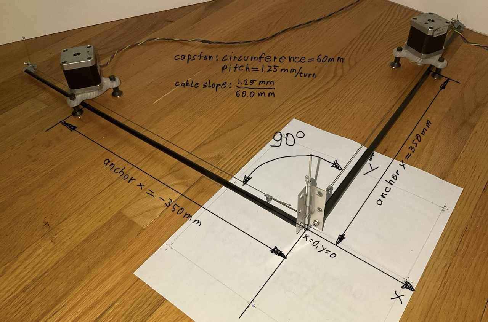

# Hingebot
## Animation

## Parametric Design Program
Click here to run "hingebot.ipynb" in Google Colab: 

Click here to run "hingebot.ipynb" in Binder: 
### Tripod Design

### Capstan Design

# Photos
## Assembled Hingebot 

## Detail: Continuous Cable Capstan

## Detail: Split Cable Capstan

# Configuration / Calibration

## Mechanical preparation
* The cables must be parallel to the axes of the coordinate system with the toolhead at the origin of the coordinate system.
* The vertical slope of the cables must patch the pitch/circumference ratio of the capstan grooves. (1.25mm/60mm)
* The vertical position of the capstan must be adjusted to match the vertical position of the cable, so that the cable does not rub against the flanks of the groove.
 
## Parameters for printer.cfg
* rotation_distance: 60 ;capstan circumference in mm
* anchor: -350 ;position of capstan/cable tangent point, mm from the origin (+350 for y)
* kinematics: hingebot ;("winch" may be used if "hingebot" is not available)
